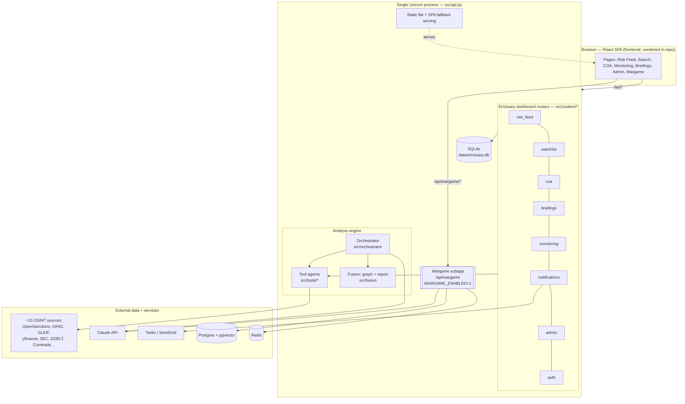

# 01 — Architecture

## Two product surfaces, one process

The system is really **two products sharing one FastAPI process and one frontend**:

1. **The OSINT analysis engine** — the original "ask a question, get an impact assessment"
   pipeline. A Claude **orchestrator** decomposes a question into a research plan, **tool
   agents** pull data from free public sources in parallel, and a **fusion** layer renders
   the result as markdown + an entity graph.

2. **The "Emissary" dashboard** — an analyst workbench layered on top: a proactive **risk
   feed**, per-user **watchlists**, **courses of action (COA)**, **briefings**, **monitoring**,
   and **notifications** (SMS/email). These are the FastAPI routers in `src/routers/` backed
   by a local SQLite database.

A third, optional surface — the **wargame** (multi-agent geopolitical simulation) — is a
*separate* FastAPI app mounted as a subapp at `/api/wargame` when `WARGAME_ENABLED=1`. It has
its own Postgres + Redis and its own docs ([07-submodules/swarm-wargame.md](07-submodules/swarm-wargame.md)).



## Layer 1 — the Orchestrator (`src/orchestrator/`)

`Orchestrator.analyze(query)` in [src/orchestrator/main.py](../src/orchestrator/main.py) is the
"quarterback." The pipeline:

1. **`_decompose(query)`** — asks Claude (using `DECOMPOSITION_PROMPT` in
   [src/orchestrator/prompts.py](../src/orchestrator/prompts.py)) to turn the question into a
   research plan: a list of steps, each naming a tool + params, with optional dependencies (a DAG).
   Runs on the faster **`CLAUDE_DECOMPOSE_MODEL`** (Haiku by default; synthesis stays on Sonnet).
   The plan is then capped by **`_cap_plan`** to `ORCH_MAX_TOOLS` total agents (default 24) so a
   verbose decomposition can't blow up runtime. If Claude's output can't be parsed,
   **`_fallback_plan(query)`** supplies a deterministic plan.
2. **`_execute_plan(plan)`** — runs steps in **topological waves**: independent steps run
   concurrently via `asyncio.gather`, dependent steps wait. **Tools within a step also run
   concurrently**; a single run-wide `asyncio.Semaphore(ORCH_MAX_CONCURRENCY)` (default 8) caps
   total in-flight tool calls (and peak memory). Each step calls **`_execute_step`** →
   `ToolRegistry.call_tool(name, params)`.
3. **`_synthesize(query, tool_results)`** — asks Claude (`SYNTHESIS_PROMPT`) to fuse the raw
   tool results into an `ImpactAssessment`, including a **friendly-fire** section (reverse
   exposure: which US/allied entities are also hit).

Supporting modules: [entity_resolver.py](../src/orchestrator/entity_resolver.py) (classify a
query as company / person / sector / vessel) and [person_search.py](../src/orchestrator/person_search.py)
(person-centric graph building). The CLI entry `python -m src.orchestrator.main "question"`
runs this pipeline outside the web server.

### ToolRegistry (`src/orchestrator/tool_registry.py`)

`ToolRegistry` lazily imports every tool (`_ensure_loaded`) and dispatches by name
(`call_tool`). It is the single seam between the orchestrator and the Layer-2 tools — the
orchestrator never imports a tool directly.

## Layer 2 — Tool agents (`src/tools/<domain>/`)

Each domain wraps one or more external data sources behind a uniform envelope. Convention
(see [04-tools-and-data.md](04-tools-and-data.md)) is `server.py` (MCP tool functions) +
`client.py` (raw API client) + `models.py` (Pydantic shapes). Every tool returns a
**`ToolResponse`** — `data` + `confidence` (HIGH/MEDIUM/LOW) + `sources` (provenance) +
`timestamp` + `errors`. Responses are cached to disk (`src/common/cache.py`) to respect
free-tier rate limits.

> Many endpoints in the analysis/search routers (`src/routers/`) call these tool **clients
> directly** (e.g. `YFinanceClient`, `SECEdgarClient`) rather than going through the orchestrator
> — the engine and the dashboard are two consumers of the same Layer-2 tools.

## Layer 3 — Fusion (`src/fusion/`)

- [graph_builder.py](../src/fusion/graph_builder.py) — assembles an `EntityGraph` (entities +
  relationships) from tool results.
- [renderer.py](../src/fusion/renderer.py) — renders markdown reports and vis.js-compatible
  graph JSON for the frontend.

## The Emissary dashboard layer (`src/routers/`, `src/db.py`)

Routers add the analyst workbench on top of the engine. They persist to a local **SQLite**
database ([src/db.py](../src/db.py); 12 tables: `coas`, `briefings`, `exercises`, `injects`,
`activity_log`, `usage_events`, `watchlist_items`, `users`, `notification_log`, the
issue-#29 knowledge store `saved_entities` + `saved_edges`, and the issue-#32
`priorities`). Highlights:

- **risk_feed** + **watchlist** — per-user entity watchlists drive a card-style risk feed;
  clicking an item triggers enrichment ([src/risk_feed/enrich.py](../src/risk_feed/enrich.py)).
- **coa** / **briefings** — AI-generated courses of action and briefings (rate-limited LLM endpoints).
- **monitoring** — KPIs, activity log, map data, macro indicators; a `/ws/monitoring` WebSocket
  pushes live activity.
- **notifications** — Twilio SMS + SendGrid email weekly digest, cron-triggered. See
  [notifications-setup.md](notifications-setup.md).

See [03-backend-and-api.md](03-backend-and-api.md) for the full endpoint catalog and how
`api.py` (now thin app composition) relates to the routers.

## Request lifecycle: `POST /api/analyze`

```
Client → POST /api/analyze {query}   (handled by routers/orchestrator.py)
  → start_analysis(): make 8-char analysis_id, store status in the in-memory _analyses store
                      (src/common/analyses.py), spawn asyncio.create_task(_run_analysis(id, query)),
                      return {analysis_id}
  → _run_analysis(): Orchestrator.analyze() → _decompose → _execute_plan (tool waves) → _synthesize
                     → store ImpactAssessment + rendered markdown + graph in _analyses[id]
Client → GET /api/analyze/{id}  (poll)  → returns status + incremental progress list, then the final result
```

The orchestrator's `progress_callback` appends human-readable steps to `_analyses[id]["progress"]`,
which the poll returns. There is **no per-analysis WebSocket** — the only socket is `/ws/monitoring`
(the dashboard's live activity feed).

> **Note:** the `_analyses` store now lives in [src/common/analyses.py](../src/common/analyses.py)
> (relocated out of `api.py` in Phase 2), but it is still an **in-memory**, process-local store:
> analyses are lost on restart and not shared across multiple workers/instances. This durability
> concern is still tracked in [08-fragility-map.md](08-fragility-map.md).

## Core data models (`src/common/types.py`)

These Pydantic models are the contracts between layers. Keep the frontend's `src/types.ts` in
sync when they change.

| Model | Role |
|-------|------|
| `Confidence` | enum: `HIGH` / `MEDIUM` / `LOW` |
| `SourceReference` | provenance: name, url, record_url, accessed_at, dataset_version |
| `ToolResponse` | **the Layer-2 envelope**: `data`, `confidence`, `sources`, `timestamp`, `errors` |
| `Entity` | id, name, entity_type, aliases, country, identifiers (lei/ofac_id/…) |
| `Relationship` | source_id, target_id, relationship_type, properties, confidence, sources |
| `EntityGraph` | entities + relationships, with `add_entity` / `add_relationship` / `merge` |
| `ScenarioType` | enum: sanction impact, supply-chain disruption, investment interception, … |
| `AnalystQuery` | raw_query + parsed scenario_type + target_entities + parameters |
| `ImpactAssessment` | **the final output**: executive_summary, findings, friendly_fire, entity_graph, confidence_summary, sources, recommendations, tool_results |

## Configuration model (consolidated in Phase 2)

App configuration is now centralized in **`src/common/config.py`** — a `Config` dataclass
(singleton `config`) that is the single source of truth for the analysis engine, notifications,
and the previously-scattered settings:

1. **`APP_ENV`** (`development` | `staging` | `production`) with an `is_production` property
   drives prod-only validation.
2. The settings that used to be read via scattered `os.getenv` calls — `CORS_ORIGINS`,
   `WARGAME_ENABLED`, `EMISSARY_MOCK_DATA`, `RISK_FEED_MODE`, the demo creds (`EMISSARY_DEMO_*`),
   `EMISSARY_AUTH_SECRET`, `EMISSARY_ADMIN_USERS` — now live on `config` alongside the engine vars.
3. **`config.validate()`** is stronger: it always requires `ANTHROPIC_API_KEY`, and in production
   it fails loudly on misconfig (e.g. `EMISSARY_AUTH_SECRET` left at the dev default, empty
   `CORS_ORIGINS`).

The wargame subapp keeps its **own** pydantic-settings class
(`src/wargame_backend/app/config.py`: `DATABASE_URL`, `REDIS_URL`, `AGENT_MODEL`,
`VOYAGE_API_KEY`, …) by design. The complete variable list is in
[06-deployment-render.md](06-deployment-render.md).
